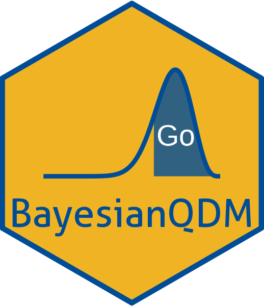

# BayesianQDM 

<!-- badges: start -->
[](http://cran.r-project.org/package=BayesianQDM)
[](https://github.com/gosukehommaEX/BayesianQDM/actions)
[](https://codecov.io/gh/gosukehommaEX/BayesianQDM?branch=main)
[](https://lifecycle.r-lib.org/articles/stages.html#stable)
<!-- badges: end -->

## Overview
  
`BayesianQDM` is an R package that provides comprehensive methods for Bayesian quantitative decision-making in clinical trials. The package supports both binary and continuous endpoints with various study designs including controlled, uncontrolled, and external control designs.

### Key Features

- **Endpoint Types**: Binary (response/non-response) and continuous (biomarker changes, scores)
- **Study Designs**: Controlled, uncontrolled, and external control designs
- **Decision Framework**: Go/NoGo/Gray zones for evidence-based decision making
- **Calculation Methods**: Multiple approaches optimized for accuracy and speed
- **Prior Integration**: Flexible prior specifications including efficient power priors for external data

### Decision Framework

The package implements a three-zone Bayesian decision framework:
  
- **Go**: Sufficient evidence to proceed to next phase (high posterior probability of efficacy)
- **NoGo**: Insufficient evidence to proceed (low posterior probability of efficacy)  
- **Gray**: Inconclusive evidence (intermediate posterior probability requiring additional data)

For technical details about the methodology, please refer to Kang et al. (20XX).

## Installation

### From CRAN (when available)
``` r
install.packages("BayesianQDM")
```

### Development Version
``` r
# Install from GitHub
devtools::install_github("gosukehommaEX/BayesianQDM")

# Or with dependencies
devtools::install_github("gosukehommaEX/BayesianQDM", dependencies = TRUE)
```

## Quick Start

### Binary Endpoints Example

``` r
library(BayesianQDM)

# Calculate Go/NoGo/Gray probabilities for binary endpoint
result_binary <- BayesDecisionProbBinary(
  prob = 'posterior', design = 'controlled', 
  theta.TV = 0.3, theta.MAV = 0.1, gamma1 = 0.8, gamma2 = 0.2,
  pi1 = c(0.3, 0.5, 0.7), pi2 = rep(0.2, 3), 
  n1 = 15, n2 = 15,
  a1 = 0.5, a2 = 0.5, b1 = 0.5, b2 = 0.5,
  z = NULL, m1 = NULL, m2 = NULL,
  ne1 = NULL, ne2 = NULL, ye1 = NULL, ye2 = NULL, ae1 = NULL, ae2 = NULL
)

print(result_binary)
```

### Continuous Endpoints Example

``` r
# Calculate decision probabilities for continuous endpoint  
result_continuous <- BayesDecisionProbContinuous(
  nsim = 100, prob = 'posterior', design = 'controlled', 
  prior = 'vague', CalcMethod = 'WS',
  theta.TV = 1.5, theta.MAV = 0.5, theta.NULL = NULL,
  nMC = NULL, gamma1 = 0.8, gamma2 = 0.3,
  n1 = 12, n2 = 12, m1 = NULL, m2 = NULL,
  mu1 = 4.5, mu2 = 2.0, sigma1 = 1.5, sigma2 = 1.3,
  seed = 123
)

print(result_continuous)
```

## Documentation

### 📚 Comprehensive Vignettes

The package includes detailed vignettes with practical examples:
  
- **[Introduction to BayesianQDM](https://gosukehommaEX.github.io/BayesianQDM/articles/BayesianQDM.html)**: Overview and quick start guide
- **[Binary Endpoints](https://gosukehommaEX.github.io/BayesianQDM/articles/binary-endpoints.html)**: Detailed examples for binary outcome analysis  
- **[Continuous Endpoints](https://gosukehommaEX.github.io/BayesianQDM/articles/continuous-endpoints.html)**: Comprehensive guide for continuous outcome analysis

### 📖 Function Documentation

- **[Full Reference](https://gosukehommaEX.github.io/BayesianQDM/reference/index.html)**: Complete function documentation with examples

### 🌐 Package Website

Visit our [pkgdown website](https://gosukehommaEX.github.io/BayesianQDM/) for:
- Interactive documentation
- Downloadable examples
- Method comparisons
- Best practice guides

### Local Access

Access vignettes locally after installation:
  ``` r
# View available vignettes
vignette(package = "BayesianQDM")

# Open specific vignettes
vignette("BayesianQDM")
vignette("binary-endpoints", package = "BayesianQDM")  
vignette("continuous-endpoints", package = "BayesianQDM")
```

## Core Functions

### Decision Making Functions
- `BayesDecisionProbBinary()` - Go/NoGo/Gray probabilities for binary endpoints
- `BayesDecisionProbContinuous()` - Go/NoGo/Gray probabilities for continuous endpoints

### Probability Calculation Functions  
- `BayesPostPredBinary()` - Posterior/predictive probabilities for binary data
- `BayesPostPredContinuous()` - Posterior/predictive probabilities for continuous data

### Distribution Functions
- `pBetadiff()`, `pBetaBinomdiff()` - Beta distribution differences
- `pNIdifft()`, `pWSdifft()`, `pMCdifft()` - t-distribution differences  
- `AppellsF1()` - Appell's hypergeometric function

## Calculation Methods

### For Continuous Endpoints

| Method | Description | Use Case |
|--------|-------------|----------|
| **NI** | Numerical Integration | Most accurate, recommended for final analyses |
| **WS** | Welch-Satterthwaite | Fast approximation, good for simulations |
| **MC** | Monte Carlo | Flexible, handles complex scenarios |

### Method Comparison Example

``` r
# Compare calculation methods
mu1 <- 3.5; mu2 <- 1.8; sd1 <- 1.3; sd2 <- 1.1; nu1 <- 14; nu2 <- 16

# Numerical integration (exact)
prob_ni <- pNIdifft(q = 1.5, mu.t1 = mu1, mu.t2 = mu2, 
                   sd.t1 = sd1, sd.t2 = sd2, nu.t1 = nu1, nu.t2 = nu2)

# Welch-Satterthwaite approximation (fast)  
prob_ws <- pWSdifft(q = 1.5, mu.t1 = mu1, mu.t2 = mu2,
                   sd.t1 = sd1, sd.t2 = sd2, nu.t1 = nu1, nu.t2 = nu2)

cat("NI:", round(prob_ni, 4), "WS:", round(prob_ws, 4), 
    "Diff:", round(abs(prob_ni - prob_ws), 4))
```

## Study Design Examples

### Controlled Design
Standard two-arm randomized controlled trial.

### Uncontrolled Design  
Single-arm study with comparison to historical control.

### External Control Design
Incorporating historical data using power priors with exact conjugate representation.

## Prior Distributions

### Binary Endpoints
- **Beta priors**: Beta(a, b) for response probabilities
- **Common choices**: Beta(0.5, 0.5) for Jeffreys prior, Beta(1, 1) for uniform

### Continuous Endpoints  
- **Vague priors**: Non-informative approach letting data drive conclusions
- **Normal-Inverse-Chi-squared**: Conjugate priors for incorporating prior knowledge
- **Power priors**: Exact conjugate representation for external data incorporation

## Advanced Features

### Power Prior Integration
Control the degree of borrowing from external data using exact conjugate representation:

``` r
# Example with external control data
result_external <- BayesPostPredContinuous(
  prob = 'posterior', design = 'external', prior = 'vague', CalcMethod = 'NI',
  theta0 = 1.5, n1 = 12, n2 = 12, 
  bar.y1 = 4, bar.y2 = 2, s1 = 1.2, s2 = 1.1,
  ne2 = 20, alpha02 = 0.5,           # External control parameters
  bar.ye2 = 1.8, se2 = 1.0           # Historical sample statistics
)

# Power prior parameters control borrowing strength:
# α = 0: No borrowing (ignore external data)
# α = 1: Full borrowing (external data weighted equally)
# 0 < α < 1: Partial borrowing
```

### External Data Examples

For continuous endpoints with historical data:

``` r
# External control design with power priors
result_power_prior <- BayesDecisionProbContinuous(
  nsim = 100, prob = 'posterior', design = 'external', 
  prior = 'vague', CalcMethod = 'WS',
  theta.TV = 1.0, theta.MAV = 0.0, theta.NULL = NULL,
  nMC = NULL, gamma1 = 0.8, gamma2 = 0.2,
  n1 = 15, n2 = 15, mu1 = 3.0, mu2 = 1.5, sigma1 = 1.2, sigma2 = 1.1,
  ne1 = 25, ne2 = 25,                    # External sample sizes
  alpha01 = 0.6, alpha02 = 0.7,          # Power prior parameters
  bar.ye1 = 2.8, bar.ye2 = 1.4,          # Historical sample means
  se1 = 1.3, se2 = 1.2,                  # Historical sample SDs
  seed = 123
)

print(result_power_prior)
```

### Operating Characteristics
Evaluate decision framework performance:
``` r
# Simulate trials across different scenarios
scenarios <- expand.grid(
  true_effect = c(0, 0.5, 1.0, 1.5, 2.0),
  sample_size = c(15, 25, 35)
)

# Calculate Go probabilities for each scenario
# (implementation details in vignettes)
```

## Performance Considerations

### Computational Efficiency
The package now uses **exact conjugate representation** for power priors, providing:

- **No MCMC required**: Closed-form computation for external data incorporation
- **Significant speed improvement**: Orders of magnitude faster than traditional power prior methods
- **Complete Bayesian rigor**: No approximation involved in power prior calculations

### Method Selection
- **NI method**: Most accurate, recommended for final analyses
- **WS method**: Fast approximation, excellent for large simulation studies
- **MC method**: Flexible, handles complex scenarios with adjustable precision

For large simulation studies, consider:
- Using WS method for efficient screening
- NI method for final analyses
- Parallel processing for Monte Carlo methods
- Leveraging exact power prior computation for external data scenarios

## Technical Innovation

### Exact Conjugate Power Priors
BayesianQDM implements a breakthrough approach to power prior computation:

- **Mathematical equivalence**: Power priors for normal data are exactly equivalent to Normal-Inverse-Chi-squared distributions
- **Closed-form solutions**: Eliminates computational burden of MCMC sampling
- **Theoretical rigor**: Preserves complete Bayesian framework without approximation
- **Practical benefits**: Enables efficient simulation studies and real-time analysis

This innovation makes power prior analysis computationally feasible for large-scale simulation studies while maintaining full statistical rigor.

## Citation

If you use BayesianQDM in your research, please cite:

```
Homma G, Yamaguchi Y (2025). BayesianQDM: Bayesian Quantitative
Decision-Making Framework for Binary and Continuous Endpoints.
R package version 0.1.0.
```

## References

Kang et al. (20XX). [Title]. [Journal].

## License

This project is licensed under the MIT License - see the [LICENSE.md](LICENSE.html) file for details.

## Support

- **Documentation**: See package vignettes and function help
- **Issues**: Report bugs or request features on [GitHub](https://github.com/gosukehommaEX/BayesianQDM/issues)
- **Questions**: Use GitHub Discussions for methodology questions

---
