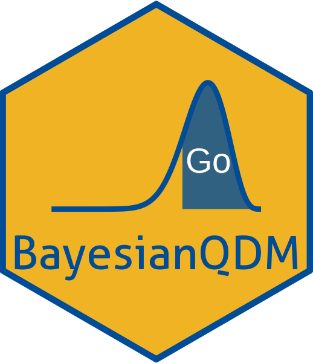

# BayesianQDM 

<!-- badges: start -->
[](http://cran.r-project.org/package=BayesianQDM)
[](https://github.com/gosukehommaEX/BayesianQDM/actions)
[](https://codecov.io/gh/gosukehommaEX/BayesianQDM?branch=main)
[](https://lifecycle.r-lib.org/articles/stages.html#stable)
<!-- badges: end -->

## Overview

BayesianQDM provides a comprehensive framework for **Bayesian Quantitative Decision-Making** in clinical trials. The package enables researchers to compute posterior probabilities, posterior predictive probabilities, and **Go/NoGo/Gray** decision probabilities for both single and two-endpoint analyses with binary and continuous outcomes.

## Key Features

- **Single and Two Endpoints**: Supports single binary, single continuous, two binary, and two continuous endpoint analyses
- **Multiple Study Designs**: Controlled, uncontrolled (hypothetical control), and external control designs
- **Flexible Prior Specification**: Vague (Jeffreys) priors and conjugate priors (Beta, Normal-Inverse-Chi-squared, Normal-Inverse-Wishart, Dirichlet)
- **Power Priors**: Exact conjugate representation for incorporating historical or external data without MCMC
- **Multiple Calculation Methods**: Numerical integration (NI), Monte Carlo simulation (MC), and Moment-Matching approximation (MM) for continuous endpoints
- **Three-Zone Decision Framework**: Go/NoGo/Gray probability calculation with user-defined thresholds (TV and MAV)

## Installation

### From CRAN

```r
install.packages("BayesianQDM")
```

### Development Version

```r
# install.packages("devtools")
devtools::install_github("gosukehommaEX/BayesianQDM")
```

## Core Functions

### Posterior / Posterior Predictive Probability Functions

| Function | Description |
|---|---|
| `pbayespostpred1bin()` | Posterior or predictive probability for a single binary endpoint |
| `pbayespostpred1cont()` | Posterior or predictive probability for a single continuous endpoint |
| `pbayespostpred2bin()` | Joint region probabilities for two binary endpoints |
| `pbayespostpred2cont()` | Joint region probabilities for two continuous endpoints |

### Decision Probability Functions

| Function | Description |
|---|---|
| `pbayesdecisionprob1bin()` | Go/NoGo/Gray probabilities for a single binary endpoint |
| `pbayesdecisionprob1cont()` | Go/NoGo/Gray probabilities for a single continuous endpoint |
| `pbayesdecisionprob2bin()` | Go/NoGo/Gray probabilities for two binary endpoints |
| `pbayesdecisionprob2cont()` | Go/NoGo/Gray probabilities for two continuous endpoints |

### Distribution and Utility Functions

| Function | Description |
|---|---|
| `pbetadiff()` | CDF for the difference of two independent Beta distributions |
| `pbetabinomdiff()` | Beta-binomial posterior predictive probability |
| `ptdiff_NI()` | CDF for the difference of two t-distributions via numerical integration |
| `ptdiff_MC()` | CDF for the difference of two t-distributions via Monte Carlo simulation |
| `ptdiff_MM()` | CDF for the difference of two t-distributions via Moment-Matching approximation |
| `rnsbt()` | Random sampler for the bivariate non-standardised t-distribution |
| `rdirichlet()` | Random sampler for the Dirichlet distribution |
| `getjointbin()` | Joint binary probability from marginals and correlation |
| `allmultinom()` | Enumerate all multinomial outcome combinations |

## Study Designs

### Controlled Design
Standard randomised controlled trials with concurrent treatment and control groups.

### Uncontrolled Design
Single-arm studies using a hypothetical control distribution specified through prior parameters or a variance scaling factor.

### External Control Design
Incorporates historical or external control (and/or treatment) data through power priors using exact conjugate representations, enabling efficient Bayesian computation without MCMC sampling.

## Statistical Methods for Continuous Endpoints

For single continuous endpoints, three methods are available for computing the CDF of the difference between two independent t-distributions:

- **NI** (Numerical Integration): Exact computation via adaptive quadrature (`stats::integrate`)
- **MC** (Monte Carlo): Simulation-based estimation; supports vectorised batch processing
- **MM** (Moment-Matching): Closed-form approximation by matching the first two even moments of the difference distribution to a single t-distribution; fully vectorised and recommended for large-scale simulation studies

For two continuous endpoints, MC and MM methods are available for computing joint rectangular region probabilities under a bivariate t-distribution approximation (Theorem 3, Homma and Yamaguchi, 2025).

## Documentation

### Vignettes

The package includes detailed vignettes with practical examples:

- **Introduction to BayesianQDM**: Overview and framework description
- **Single Endpoint Analysis**: Examples for single binary and continuous endpoint analyses
- **Two Endpoint Analysis**: Examples for two binary and two continuous endpoint analyses

Access vignettes locally after installation:

```r
vignette(package = "BayesianQDM")
```

### Package Website

Visit the [pkgdown website](https://gosukehommaEX.github.io/BayesianQDM/) for interactive documentation and the full function reference.

## Citation

To cite BayesianQDM in publications, please use:

```
Homma, G., Yamaguchi, Y. (2025). BayesianQDM: Bayesian Quantitative
Decision-Making Framework for Binary and Continuous Endpoints.
R package version 0.1.0.
```

## License

This package is licensed under GPL (>= 3).

## Authors

- Gosuke Homma (maintainer)
- Yusuke Yamaguchi

## Issues and Contributions

To report bugs or request features, please visit our [GitHub repository](https://github.com/gosukehommaEX/BayesianQDM/issues).
